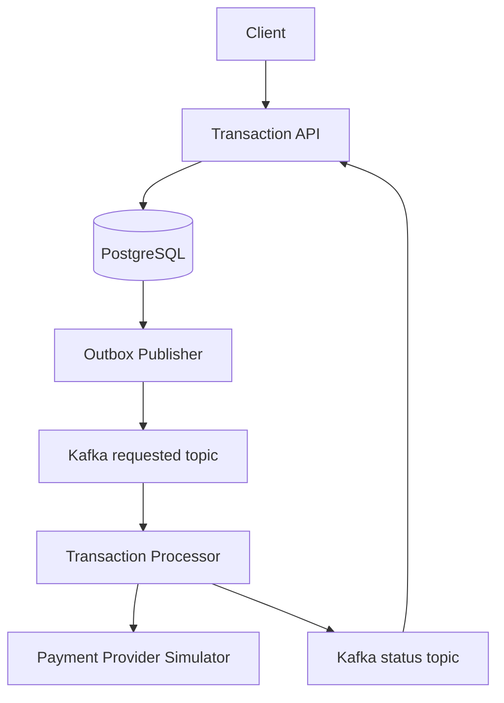
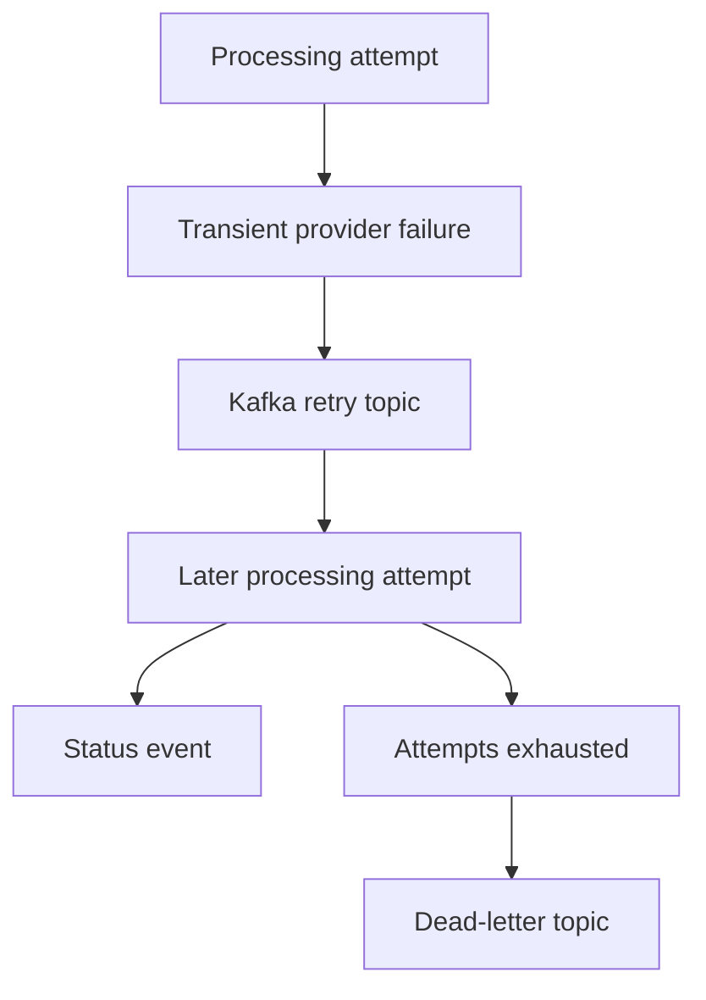

# LedgerFlow

LedgerFlow is a production-minded transaction-processing platform built to demonstrate reliable asynchronous backend design with Java 21, Spring Boot, Kafka, and PostgreSQL.

## What exists in this skeleton

- `transaction-api`: accepts idempotent transaction requests, owns authoritative state, records status history, writes an outbox event atomically, and operates its publication backlog.
- `transaction-processor`: consumes requested events, protects its idempotent provider call with retries and a circuit breaker, and emits processing/result events.
- `payment-provider-simulator`: deterministic idempotent stand-in for an unreliable downstream provider.
- `transaction-contracts`: versioned event and provider DTOs shared during the first development phase.
- `ledgerflow-e2e-tests`: boots the three applications against ephemeral PostgreSQL and Kafka containers and verifies the complete lifecycle, concurrent idempotency, Kafka redelivery, retries, timeouts, circuit breaking, and dead-letter handling.
- `docs`: technical specification, architecture, and ADRs.

## Architecture



Failure handling is asynchronous and bounded:



PostgreSQL is the source of record. Redis is deliberately deferred until a measured caching or coordination use case exists.

The transactional outbox prevents lost events across the database/Kafka boundary, while idempotency, retry topics, circuit breaking, and dead-letter handling make at-least-once processing safe.

## Local prerequisites

- Java 21
- Maven 3.9+
- Docker with Compose

## Run

```bash
docker compose up --build
```

Create a transaction:

```bash
curl -i http://localhost:8080/transactions \
  -H 'Content-Type: application/json' \
  -H 'Idempotency-Key: abc-123' \
  -d '{"accountId":"acct-42","amount":125.50,"currency":"USD","type":"PAYMENT"}'
```

The API returns `202 Accepted` and a transaction ID. Retrieve it with:

```bash
curl http://localhost:8080/transactions/{transactionId}
```

Health endpoints are available at `/actuator/health` on ports 8080, 8081, and 8082.

Outbox metrics are available through the transaction API's Actuator metrics and Prometheus endpoints:

- `ledgerflow.outbox.pending`
- `ledgerflow.outbox.oldest.pending.age`
- `ledgerflow.outbox.publish.success`
- `ledgerflow.outbox.publish.failure`
- `ledgerflow.outbox.cleanup.deleted`
- `ledgerflow.outbox.metrics.refresh.failure`

Published outbox events are retained for seven days by default and then removed in bounded, concurrency-safe batches. Unpublished events are never eligible for cleanup.

See [the operations guide](docs/operations.md) for signal interpretation and configuration.

## Build

Linux/macOS:

```bash
./mvnw clean verify
```

Windows PowerShell:

```powershell
.\mvnw.cmd clean verify
```

`verify` requires a running Docker engine because the Failsafe integration-test phase starts isolated PostgreSQL and Kafka containers. Unit tests alone can be run without Docker:

```bash
./mvnw test
```

See [the testing guide](docs/testing.md) for the end-to-end topology and debugging commands.

## Delivery roadmap

1. Add stuck-transaction reconciliation and repair coverage.
2. Add Redis only for justified acceleration or coordination.
3. Add OpenTelemetry, Prometheus, Grafana, and trace examples.
4. Add Kubernetes manifests, IaC, and measured load tests.

See [the technical specification](docs/technical-specification.md) for the precise contracts and invariants.
