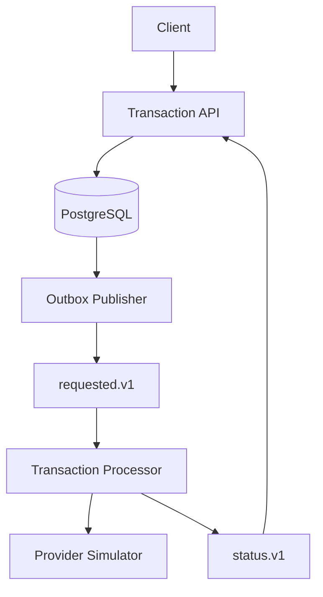
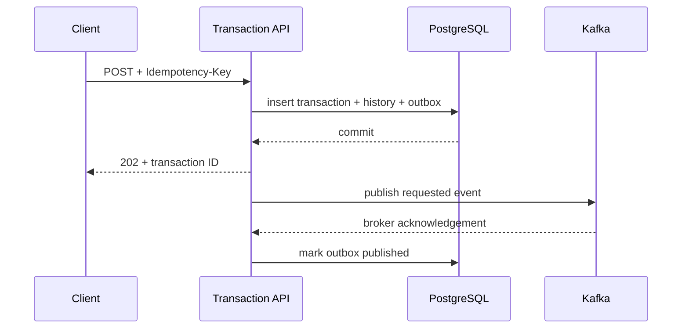
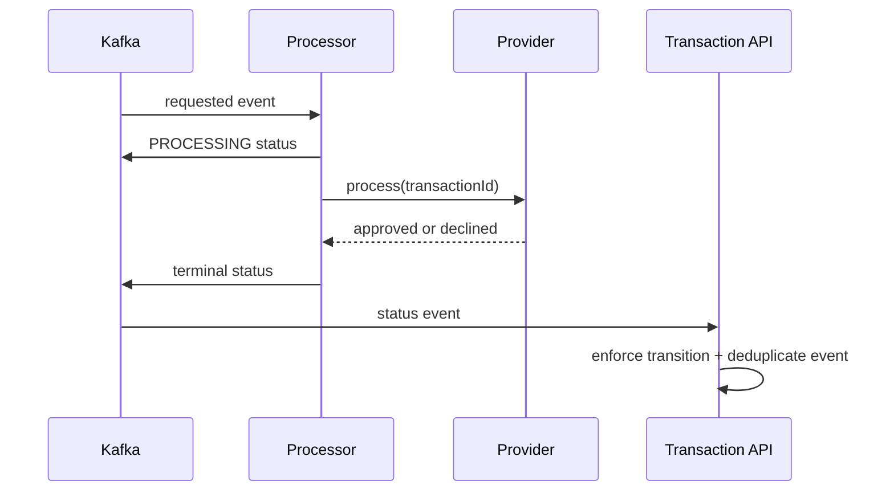

# Architecture

## Runtime flow

## Creation sequence

The last two steps are intentionally not atomic. A crash between them produces a duplicate event, not lost work.

Kafka delivery is at least once. When a requested event is redelivered, the processor repeats the provider call with the same transaction ID as its idempotency key. The provider returns the original decision, and the transaction API treats repeated or stale status changes as no-ops. See [ADR-004](adr/ADR-004-at-least-once-consumer-idempotency.md).

Transient processing failures move through non-blocking Kafka retry topics with exponential backoff. Attempts are bounded, after which the record moves to a dead-letter topic for explicit failure handling. See [ADR-005](adr/ADR-005-retry-and-dead-letter-strategy.md).

## Provider sequence

