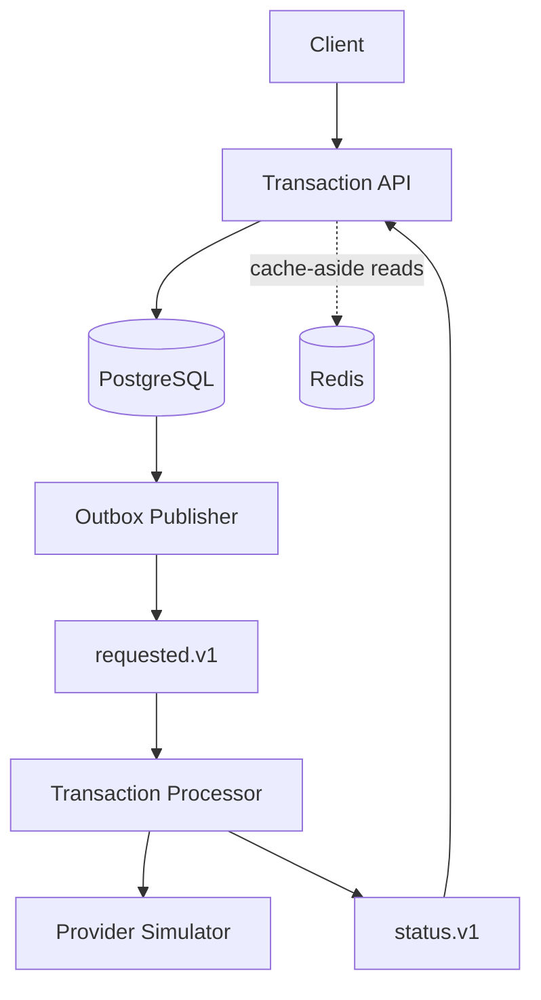
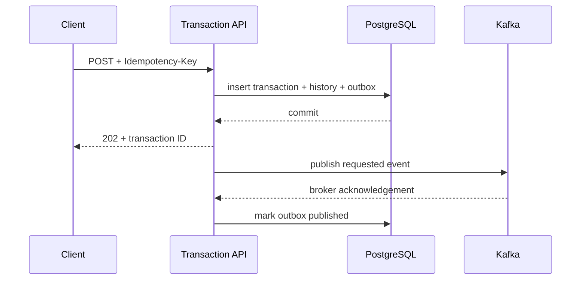
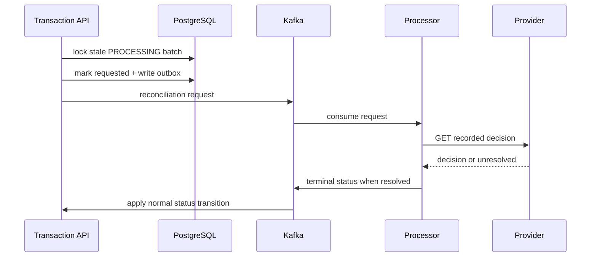
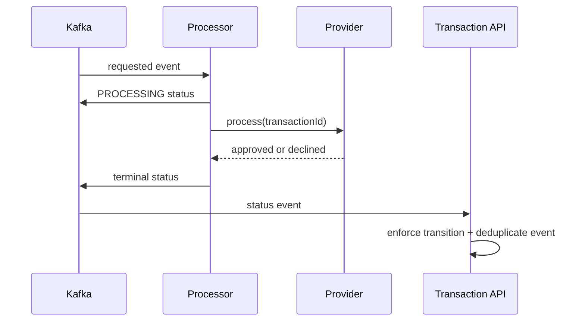

# Architecture

## Runtime flow

## Creation sequence

The last two steps are intentionally not atomic. A crash between them produces a duplicate event, not lost work.

Kafka delivery is at least once. When a requested event is redelivered, the processor repeats the provider call with the same transaction ID as its idempotency key. The provider returns the original decision, and the transaction API treats repeated or stale status changes as no-ops. See [ADR-004](adr/ADR-004-at-least-once-consumer-idempotency.md).

Transient processing failures move through non-blocking Kafka retry topics with exponential backoff. Attempts are bounded, after which the record moves to a dead-letter topic for explicit failure handling. See [ADR-005](adr/ADR-005-retry-and-dead-letter-strategy.md).

Provider HTTP calls use bounded connect and read timeouts. Because a timeout leaves the downstream outcome unknown, every retry reuses the transaction ID and can recover a provider decision completed after an earlier client timeout. See [ADR-006](adr/ADR-006-provider-timeout-semantics.md).

Published outbox rows are retained for a configurable period and then removed in bounded batches. Cleanup locks only its selected rows and skips rows already locked by another application instance. Backlog size, oldest-pending-event age, publish outcomes, and cleanup throughput are exposed as Micrometer metrics. See [ADR-007](adr/ADR-007-outbox-retention-and-monitoring.md).

Repeated transaction retrieval uses a cache-aside Redis layer. PostgreSQL remains authoritative: cache misses and Redis failures read from PostgreSQL, while status changes evict only after their database transaction commits. A short TTL bounds staleness if eviction fails. See [ADR-009](adr/ADR-009-redis-transaction-read-cache.md).

## Reconciliation sequence

The scan and reconciliation-request outbox write commit together. A missing provider record or incomplete decision leaves authoritative state unchanged and becomes eligible for another request after the configured delay. See [ADR-008](adr/ADR-008-stuck-transaction-reconciliation.md).

## Provider sequence

